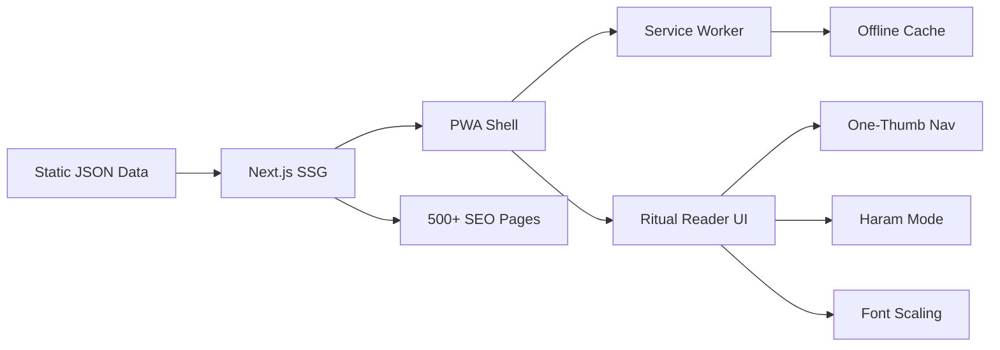

# Dua Nexus: High-Readability Umrah/Hajj Ritual Reader PWA

## Tech Stack

- **Framework:** Next.js 14 (App Router) -- SSG for programmatic SEO pages, fast loading
- **PWA:** `@ducanh2912/next-pwa` for service worker + offline caching
- **Styling:** Tailwind CSS -- rapid utility-first styling for the "Haram Mode" UI
- **Fonts:** `@fontsource/amiri-quran` (npm, WOFF2, 44.6KB) for Arabic text; system sans-serif for English/transliteration
- **Data:** Static JSON files embedded in the build (no backend needed)
- **Deployment:** Vercel (free tier, automatic HTTPS, edge CDN)

## Architecture




## Data Model

All dua content lives in static JSON files under `src/data/`:

- `rituals.json` -- master sequence of all rituals
- `umrah/` -- folder with per-ritual JSON files
- `hajj/` -- folder with per-day, per-ritual JSON files
- `common/` -- shared duas (entering masjid, drinking zamzam, etc.)

Each dua entry follows this schema:

```typescript
interface Dua {
  id: string;
  arabic: string;           // Full Arabic text
  transliteration: string;  // Latin transliteration
  translation: string;      // English meaning
  reference?: string;       // Hadith/Quran source
  note?: string;            // Contextual guidance
}

interface RitualStep {
  id: string;
  ritual: "umrah" | "hajj";
  category: string;         // e.g., "tawaf", "sai", "miqat"
  title: string;
  titleAr: string;
  sequence: number;         // Global ordering
  subSequence?: number;     // e.g., circuit 1-7
  instructions: string;     // What to do physically
  duas: Dua[];
}
```

### Ritual Sequences to Cover

**Umrah (4 pillars, ~15 steps):**

1. Preparation / Ghusl
2. Ihram at Miqat (niyyah + talbiyah)
3. Entering Masjid al-Haram
4. First sight of Kaaba dua
5. Tawaf -- Circuits 1 through 7 (each with its own dua)
6. Dua between Yemeni Corner and Black Stone
7. Prayer at Maqam Ibrahim (2 rakat)
8. Drinking Zamzam
9. Sa'i -- Laps 1 through 7 (Safa to Marwa)
10. Dua at Safa / Dua at Marwa
11. Halq / Taqsir (completion)

**Hajj (6 days, ~25 steps):**

- Day 1 (8th Dhul Hijjah): Ihram, travel to Mina, prayers
- Day 2 (9th): Arafah -- Wuquf, combined prayers, abundant dua
- Night: Muzdalifah -- combined prayers, pebble collection
- Day 3 (10th / Eid): Rami at Jamarat al-Aqabah, Qurbani, Tawaf al-Ifadah, Sa'i
- Days 4-5 (11th-12th): Tashreeq days, Rami at all 3 Jamarat
- Farewell: Tawaf al-Wada

**Common Duas:** Entering/leaving masjid, after wudu, travel duas, general supplications

## UI / UX Design

### "Haram Mode" (High-Contrast Sun Mode)

- Background: `#FFFFFF` (pure white)
- Text: `#000000` (pure black)
- Accent: `#1B5E20` (deep Islamic green) for active states only
- Zero images, zero watermarks, zero gradients
- No decorative elements that reduce contrast

### Typography Scale

- Arabic body: `24px`, font-family: `Amiri Quran`, line-height: `1.8`
- Transliteration: `18px`, font-family: system sans-serif, line-height: `1.6`
- Translation: `16px`, font-family: system sans-serif, line-height: `1.5`
- All text sizes adjustable via a floating `A+`/`A-` button

### One-Thumb Navigation

- Bottom 25% of screen reserved for navigation
- Giant "Next" / "Previous" buttons (min 56px tall, full-width)
- Swipe left/right gesture support for page flipping
- Current position indicator: "Circuit 3 of 7" at the top
- Sticky header with ritual name + progress (thin bar)

### Page Layout (per dua screen)

```
+----------------------------------+
| [< Back]  Tawaf - Round 3  [A+] |  <- thin sticky header
| ========== 3/7 ============      |  <- progress bar
|                                  |
|   بسم الله الرحمن الرحيم         |  <- Arabic (large, RTL, centered)
|                                  |
|   Bismillahir Rahmanir Raheem    |  <- Transliteration (medium)
|                                  |
|   In the name of Allah...        |  <- Translation (smaller)
|                                  |
|   [Source: Sahih Muslim 1234]    |  <- Reference (muted)
|                                  |
|                                  |
|  +------- NAVIGATION -----------+|
|  |  [< Previous]  [Next >]      ||  <- bottom 25%
|  +-------------------------------+|
+----------------------------------+
```

### Ritual Selection (Home Screen)

```
+----------------------------------+
|   Dua Nexus                      |
|   Your Umrah & Hajj Companion    |
|                                  |
|   +---------------------------+  |
|   |  UMRAH GUIDE              |  |  <- Large tap target
|   |  4 pillars, 15 steps      |  |
|   +---------------------------+  |
|                                  |
|   +---------------------------+  |
|   |  HAJJ GUIDE               |  |
|   |  6 days, 25+ steps        |  |
|   +---------------------------+  |
|                                  |
|   +---------------------------+  |
|   |  MY PERSONAL DUAS         |  |  <- User-added duas
|   |  Add your family's requests|  |
|   +---------------------------+  |
|                                  |
|   [Settings]                     |
+----------------------------------+
```

## File Structure

```
src/
  app/
    layout.tsx              -- Root layout, font loading, PWA meta
    page.tsx                -- Home screen (ritual selection)
    manifest.ts             -- PWA manifest
    umrah/
      page.tsx              -- Umrah ritual overview/sequence
      [step]/
        page.tsx            -- Individual ritual step reader
    hajj/
      page.tsx              -- Hajj day-by-day overview
      [day]/
        [step]/
          page.tsx          -- Individual Hajj step reader
    my-duas/
      page.tsx              -- Personal duas manager
    settings/
      page.tsx              -- Font size, theme preferences
    dua/
      [slug]/
        page.tsx            -- SEO landing pages (programmatic)
  components/
    DuaCard.tsx             -- Single dua display (Arabic + transliteration + translation)
    ReaderNav.tsx           -- Bottom one-thumb navigation
    ProgressBar.tsx         -- Ritual progress indicator
    FontSizeControl.tsx     -- A+/A- floating button
    RitualCard.tsx          -- Home page ritual selector card
    PersonalDuaForm.tsx     -- Add/edit personal duas
    Header.tsx              -- Sticky minimal header
    InstallPrompt.tsx       -- "Add to Home Screen" prompt
  data/
    umrah.json              -- All Umrah ritual steps + duas
    hajj.json               -- All Hajj ritual steps + duas
    common.json             -- Shared duas
    seo-slugs.json          -- Slug-to-data mapping for SEO pages
  lib/
    store.ts                -- localStorage wrapper for preferences + personal duas
    fonts.ts                -- Font configuration (Amiri Quran)
  hooks/
    useSwipeNavigation.ts   -- Touch swipe gesture handler
    usePreferences.ts       -- Font size, theme preferences
  public/
    icons/                  -- PWA icons (192x192, 512x512)
    sw.js                   -- Service worker (auto-generated by next-pwa)
  styles/
    globals.css             -- Tailwind + Haram Mode CSS variables
next.config.js              -- PWA plugin config
tailwind.config.ts          -- Custom theme (colors, fonts, spacing)
```

## Implementation Phases

### Phase 1: Project Scaffold + Data (Hours 0-8)

- Initialize Next.js 14 project with TypeScript, Tailwind, ESLint
- Install dependencies: `@ducanh2912/next-pwa`, `@fontsource/amiri-quran`
- Create the JSON data files with all Umrah ritual steps and duas (manually curated from authentic sources with proper Arabic text, transliteration, and translations)
- Create the JSON data files for Hajj rituals (day-by-day)
- Set up the data model types in `src/lib/types.ts`

### Phase 2: Core Reader UI (Hours 8-20)

- Build the `DuaCard` component with the 3-layer display (Arabic / transliteration / translation)
- Build the one-thumb `ReaderNav` with large tap targets
- Build swipe gesture navigation (`useSwipeNavigation` hook)
- Build the `ProgressBar` and sticky `Header`
- Build the `FontSizeControl` floating button
- Implement the "Haram Mode" high-contrast theme as default
- Wire up the Umrah ritual reader flow (`/umrah/[step]`)
- Wire up the Hajj ritual reader flow (`/hajj/[day]/[step]`)

### Phase 3: Home Screen + Ritual Selection (Hours 20-24)

- Build the home page with large ritual selector cards
- Build the Umrah overview page (step list with progress tracking)
- Build the Hajj overview page (day-by-day breakdown)
- Add localStorage-based progress tracking (which step you're on)

### Phase 4: PWA + Offline (Hours 24-32)

- Configure `next-pwa` in `next.config.js` with aggressive caching
- Create PWA manifest (`manifest.ts`) with icons, theme color, display: standalone
- Implement service worker caching strategy: CacheFirst for all static assets and data
- Test offline functionality (airplane mode)
- Add `InstallPrompt` component for "Add to Home Screen"

### Phase 5: Personal Duas (Hours 32-40)

- Build `PersonalDuaForm` -- paste Arabic text, auto-format to reader style
- Store personal duas in localStorage
- Render personal duas through the same `DuaCard` component
- Add ability to reorder and delete personal duas

### Phase 6: SEO + Polish (Hours 40-48)

- Generate `seo-slugs.json` with 500+ keyword-optimized slugs
- Build the programmatic SEO page template (`/dua/[slug]`)
- Add proper meta tags, Open Graph, structured data (JSON-LD)
- Add page transitions for smooth reader experience
- Final accessibility pass (ARIA labels, focus management)
- Performance audit (Lighthouse PWA score target: 95+)

## Key Technical Decisions

- **No backend / no database** -- everything is static JSON + localStorage. This keeps the app fast, free to host, and eliminates server dependencies.
- **Next.js SSG** -- all pages are statically generated at build time. This means instant loads and perfect SEO.
- **Amiri Quran over QPC Uthmani** -- QPC Uthmani uses per-page font files designed for full Quran rendering (604 fonts). Amiri Quran is a single 44KB WOFF2 file that covers all Arabic text beautifully, making it far more practical for dua text.
- **localStorage over IndexedDB** -- the data volume is small (duas are text-only). localStorage is simpler and sufficient.
- **No audio in v1** -- audio sync is listed as Premium. We ship the reader first, add audio in v2.
- **No payment integration in v1** -- focus on the free high-readability reader. Monetization comes after user validation.

